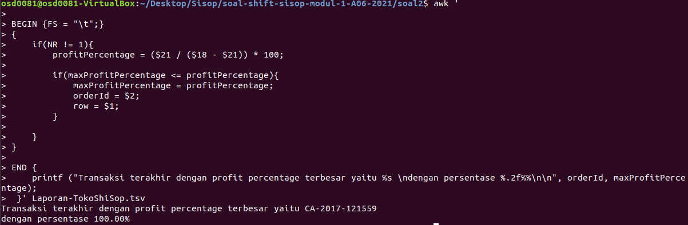
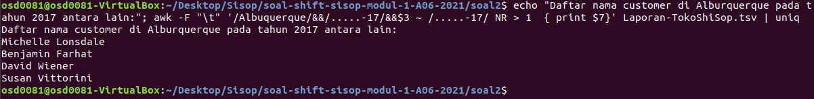
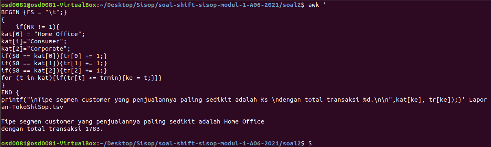
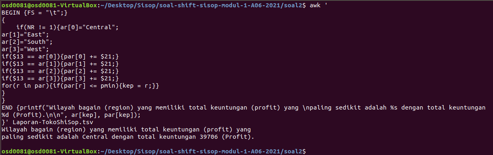

# Soal-shift-sisop-modul-1-A06-2021
Jawaban soal praktikum Sistem Operasi modul 1.

**Anggota kelompok**:

- Richard Asmarakandi - 05111940000017
- Muhammad Rafki Mardi - 0511194000054
- Husin Muhammad Assegaff - 05111940000127

---
## Tabel Konten
- [Soal 1](#soal-1)
  - [Soal 1.a](#soal-1a)
  - [Soal 1.b](#soal-1b)
  - [Soal 1.c](#soal-1c)
  - [Soal 1.d](#soal-1d)
  - [Soal 1.e](#soal-1e)

- [Soal 2](#soal-2)
  - [Soal 2.a](#soal-2a)
  - [Soal 2.b](#soal-2b)
  - [Soal 2.c](#soal-2c)
  - [Soal 2.d](#soal-2d)

- [Soal 3](#soal-3)
  - [Soal 3.a](#soal-3a)
  - [Soal 3.b](#soal-3b)
  - [Soal 3.c](#soal-3c)
  - [Soal 3.d](#soal-3d)

## Soal 1
**[Source Code Soal 1](https://github.com/husinassegaff/soal-shift-sisop-modul-1-A06-2021/blob/main/soal1/soal1.sh)**

**Deskripsi:**\
Membuat laporan aplikasi *ticky* dengan harus melakukan beberapa hal berikut,

### Soal 1.a
**Deskripsi:**\
Mengumpulkan informasi jenis log (ERROR/INFO), pesan log, dan username dari log aplikasi pada file `syslog.log`.

**Pembahasan:**

```bash
grep -oP "(INFO.*)|(ERROR.*)" syslog.log 
```
- Menggunakan `grep -oP` untuk mencari pola karakter yang diinginkan
- Pada `(INFO.*)|(ERROR.*)` bermakna bahwa mencari baris yang terdapat kata "INFO" atau "ERROR" dan ditampilkan karakternya mulai dari "INFO" atau "ERROR" sampai akhir baris masing-masing.
- Untuk `syslog.log` merupakan file yang digunakan untuk mengeksekusi perintah yang diinginkan. Sehingga hasilnya sebagai berikut:

```
Jan 31 00:09:39 ubuntu.local ticky: INFO Created ticket [#4217] (mdouglas)
Jan 31 00:16:25 ubuntu.local ticky: INFO Closed ticket [#1754] (noel)
Jan 31 00:21:30 ubuntu.local ticky: ERROR The ticket was modified while updating (breee)
Jan 31 00:44:34 ubuntu.local ticky: ERROR Permission denied while closing ticket (ac)
Jan 31 01:00:50 ubuntu.local ticky: INFO Commented on ticket [#4709] (blossom)
Jan 31 01:29:16 ubuntu.local ticky: INFO Commented on ticket [#6518] (rr.robinson)
Jan 31 01:33:12 ubuntu.local ticky: ERROR Tried to add information to closed ticket (mcintosh)
Jan 31 01:43:10 ubuntu.local ticky: ERROR Tried to add information to closed ticket (jackowens)
Jan 31 01:49:29 ubuntu.local ticky: ERROR Tried to add information to closed ticket (mdouglas)
Jan 31 02:30:04 ubuntu.local ticky: ERROR Timeout while retrieving information (oren)
Jan 31 02:55:31 ubuntu.local ticky: ERROR Ticket doesn't exist (xlg)
Jan 31 03:05:35 ubuntu.local ticky: ERROR Timeout while retrieving information (ahmed.miller)
Jan 31 03:08:55 ubuntu.local ticky: ERROR Ticket doesn't exist (blossom)
Jan 31 03:39:27 ubuntu.local ticky: ERROR The ticket was modified while updating (bpacheco)
Jan 31 03:47:24 ubuntu.local ticky: ERROR Ticket doesn't exist (enim.non)
Jan 31 04:30:04 ubuntu.local ticky: ERROR Permission denied while closing ticket (rr.robinson)
Jan 31 04:31:49 ubuntu.local ticky: ERROR Tried to add information to closed ticket (oren)
Jan 31 04:32:49 ubuntu.local ticky: ERROR Timeout while retrieving information (mcintosh)
Jan 31 04:44:23 ubuntu.local ticky: ERROR Timeout while retrieving information (ahmed.miller)
Jan 31 04:44:46 ubuntu.local ticky: ERROR Connection to DB failed (jackowens)
Jan 31 04:49:28 ubuntu.local ticky: ERROR Permission denied while closing ticket (flavia)
Jan 31 05:12:39 ubuntu.local ticky: ERROR Tried to add information to closed ticket (oren)
Jan 31 05:18:45 ubuntu.local ticky: ERROR Tried to add information to closed ticket (sri)
Jan 31 05:23:14 ubuntu.local ticky: INFO Commented on ticket [#1097] (breee)
Jan 31 05:35:00 ubuntu.local ticky: ERROR Connection to DB failed (nonummy)
Jan 31 05:45:30 ubuntu.local ticky: INFO Created ticket [#7115] (noel)
Jan 31 05:51:30 ubuntu.local ticky: ERROR The ticket was modified while updating (flavia)
Jan 31 05:57:46 ubuntu.local ticky: INFO Commented on ticket [#2253] (nonummy)
Jan 31 06:12:02 ubuntu.local ticky: ERROR Connection to DB failed (oren)
Jan 31 06:26:38 ubuntu.local ticky: ERROR Timeout while retrieving information (xlg)
Jan 31 06:32:26 ubuntu.local ticky: INFO Created ticket [#7298] (ahmed.miller)
Jan 31 06:36:25 ubuntu.local ticky: ERROR Timeout while retrieving information (flavia)
Jan 31 06:57:00 ubuntu.local ticky: ERROR Connection to DB failed (jackowens)
Jan 31 06:59:57 ubuntu.local ticky: INFO Commented on ticket [#7255] (oren)
Jan 31 07:59:56 ubuntu.local ticky: ERROR Ticket doesn't exist (flavia)
Jan 31 08:01:40 ubuntu.local ticky: ERROR Tried to add information to closed ticket (jackowens)
Jan 31 08:03:19 ubuntu.local ticky: INFO Closed ticket [#1712] (britanni)
Jan 31 08:22:37 ubuntu.local ticky: INFO Created ticket [#2860] (mcintosh)
Jan 31 08:28:07 ubuntu.local ticky: ERROR Timeout while retrieving information (montanap)
Jan 31 08:49:15 ubuntu.local ticky: ERROR Permission denied while closing ticket (britanni)
Jan 31 08:50:50 ubuntu.local ticky: ERROR Permission denied while closing ticket (montanap)
Jan 31 09:04:27 ubuntu.local ticky: ERROR Tried to add information to closed ticket (noel)
Jan 31 09:15:41 ubuntu.local ticky: ERROR Timeout while retrieving information (oren)
Jan 31 09:18:47 ubuntu.local ticky: INFO Commented on ticket [#8385] (mdouglas)
Jan 31 09:28:18 ubuntu.local ticky: INFO Closed ticket [#2452] (jackowens)
Jan 31 09:41:16 ubuntu.local ticky: ERROR Connection to DB failed (ac)
Jan 31 10:11:35 ubuntu.local ticky: ERROR Timeout while retrieving information (blossom)
Jan 31 10:21:36 ubuntu.local ticky: ERROR Permission denied while closing ticket (montanap)
Jan 31 11:04:02 ubuntu.local ticky: ERROR Tried to add information to closed ticket (breee)
Jan 31 11:19:37 ubuntu.local ticky: ERROR Connection to DB failed (sri)
Jan 31 11:22:06 ubuntu.local ticky: ERROR Timeout while retrieving information (montanap)
Jan 31 11:31:34 ubuntu.local ticky: ERROR Permission denied while closing ticket (ahmed.miller)
Jan 31 11:40:25 ubuntu.local ticky: ERROR Connection to DB failed (mai.hendrix)
Jan 31 11:47:07 ubuntu.local ticky: INFO Commented on ticket [#4562] (ac)
Jan 31 11:58:33 ubuntu.local ticky: ERROR Tried to add information to closed ticket (ahmed.miller)
Jan 31 12:00:17 ubuntu.local ticky: INFO Created ticket [#7897] (kirknixon)
Jan 31 12:02:49 ubuntu.local ticky: ERROR Permission denied while closing ticket (mai.hendrix)
Jan 31 12:20:23 ubuntu.local ticky: ERROR Connection to DB failed (kirknixon)
Jan 31 12:20:40 ubuntu.local ticky: ERROR Ticket doesn't exist (flavia)
Jan 31 12:24:32 ubuntu.local ticky: INFO Created ticket [#5784] (sri)
Jan 31 12:50:10 ubuntu.local ticky: ERROR Permission denied while closing ticket (blossom)
Jan 31 12:58:16 ubuntu.local ticky: ERROR Tried to add information to closed ticket (nonummy)
Jan 31 13:08:10 ubuntu.local ticky: INFO Closed ticket [#8685] (rr.robinson)
Jan 31 13:48:45 ubuntu.local ticky: ERROR The ticket was modified while updating (breee)
Jan 31 14:13:00 ubuntu.local ticky: INFO Commented on ticket [#4225] (noel)
Jan 31 14:38:50 ubuntu.local ticky: ERROR The ticket was modified while updating (enim.non)
Jan 31 14:41:18 ubuntu.local ticky: ERROR Timeout while retrieving information (xlg)
Jan 31 14:45:55 ubuntu.local ticky: INFO Closed ticket [#7948] (noel)
Jan 31 14:50:41 ubuntu.local ticky: INFO Commented on ticket [#8628] (noel)
Jan 31 14:56:35 ubuntu.local ticky: ERROR Tried to add information to closed ticket (noel)
Jan 31 15:27:53 ubuntu.local ticky: ERROR Ticket doesn't exist (blossom)
Jan 31 15:28:15 ubuntu.local ticky: ERROR Permission denied while closing ticket (enim.non)
Jan 31 15:44:25 ubuntu.local ticky: INFO Closed ticket [#7333] (enim.non)
Jan 31 16:17:20 ubuntu.local ticky: INFO Commented on ticket [#1653] (noel)
Jan 31 16:19:40 ubuntu.local ticky: ERROR The ticket was modified while updating (mdouglas)
Jan 31 16:24:31 ubuntu.local ticky: INFO Created ticket [#5455] (ac)
Jan 31 16:35:46 ubuntu.local ticky: ERROR Timeout while retrieving information (oren)
Jan 31 16:53:54 ubuntu.local ticky: INFO Commented on ticket [#3813] (mcintosh)
Jan 31 16:54:18 ubuntu.local ticky: ERROR Connection to DB failed (bpacheco)
Jan 31 17:15:47 ubuntu.local ticky: ERROR The ticket was modified while updating (mcintosh)
Jan 31 17:29:11 ubuntu.local ticky: ERROR Connection to DB failed (oren)
Jan 31 17:51:52 ubuntu.local ticky: INFO Closed ticket [#8604] (mcintosh)
Jan 31 18:09:17 ubuntu.local ticky: ERROR The ticket was modified while updating (noel)
Jan 31 18:43:01 ubuntu.local ticky: ERROR Ticket doesn't exist (nonummy)
Jan 31 19:00:23 ubuntu.local ticky: ERROR Timeout while retrieving information (blossom)
Jan 31 19:20:22 ubuntu.local ticky: ERROR Timeout while retrieving information (mai.hendrix)
Jan 31 19:59:06 ubuntu.local ticky: INFO Created ticket [#6361] (enim.non)
Jan 31 20:02:41 ubuntu.local ticky: ERROR Timeout while retrieving information (xlg)
Jan 31 20:21:55 ubuntu.local ticky: INFO Commented on ticket [#7159] (ahmed.miller)
Jan 31 20:28:26 ubuntu.local ticky: ERROR Connection to DB failed (breee)
Jan 31 20:35:17 ubuntu.local ticky: INFO Created ticket [#7737] (nonummy)
Jan 31 20:48:02 ubuntu.local ticky: ERROR Connection to DB failed (mdouglas)
Jan 31 20:56:58 ubuntu.local ticky: INFO Closed ticket [#4372] (oren)
Jan 31 21:00:23 ubuntu.local ticky: INFO Commented on ticket [#2389] (sri)
Jan 31 21:02:06 ubuntu.local ticky: ERROR Connection to DB failed (breee)
Jan 31 21:20:33 ubuntu.local ticky: INFO Closed ticket [#3297] (kirknixon)
Jan 31 21:29:24 ubuntu.local ticky: ERROR The ticket was modified while updating (blossom)
Jan 31 22:58:55 ubuntu.local ticky: INFO Created ticket [#2461] (jackowens)
Jan 31 23:25:18 ubuntu.local ticky: INFO Closed ticket [#9876] (blossom)
Jan 31 23:35:40 ubuntu.local ticky: INFO Created ticket [#5896] (mcintosh)
```

### Soal 1.b
**Deskripsi:**\
Menampilkan semua pesan berjenis 'ERROR' beserta jumlah kemunculannya

**Pembahasan:**

```bash
grep -oP '(?<=ERROR).*(?=\ \()' syslog.log | sort |  uniq -c | cut -b 6-99 | sort -nr | cut -b 1-2 > temps1b1.txt
grep -oP '(?<=ERROR).*(?=\ \()' syslog.log | sort |  uniq -c | cut -b 6-99 | sort -nr | cut -b 4-99 > temps1b2.txt
paste -d '\t\t' temps1b2.txt temps1b1.txt
```
- Menggunakan `grep -oP` untuk mencari pola karakter yang diinginkan
- Pada `?<=ERROR` berarti melakukan lookbehind dengan mencari kata ERROR tanpa memasukkan kata ERROR sebagai input
- Pada `.*` berarti melakukan pencarian dengan karakter sembarang setelah kata ERROR (pada konteks kali ini)
- Pada ?=<spasi> berarti melakukan lookahead agar output tidak menampilkan username
- Untuk `syslog.log` merupakan file yang digunakan untuk mengeksekusi perintah yang diinginkan. Sehingga hasilnya sebagai berikut:
- Dilakukan sorting agar pesan error yang sama (duplikat) terletak berjajar
- Uniq -c dilakukan untuk mengeliminasi pesan yang sama (duplikat) dengan option -c untuk menampilkan jumlah muncul pesan error
- cut -b 6-99 dilakukan untuk memotong spasi yang muncul pada awal string
- sort -nr dilakukan untuk sorting kembali dari angka kemunculan paling banyak
- Lalu bash baris pertama digunakan untuk memotong angka kemunculannya, sedangkan bash baris kedua digunakan untuk memotong pesan errornya
- Setelah itu digabung kan pada perintah paste
- Hasilnya akan seperti ini :

```
Timeout while retrieving information	15
Connection to DB failed	13
Tried to add information to closed ticket	12
Permission denied while closing ticket	10
The ticket was modified while updating	 9
Ticket doesn't exist	 7
```

### Soal 1.c
**Deskripsi:**\
Menampilkan jumlah kemunculan log ERROR dan INFO untuk setiap *user*.

**Pembahasan:**

```bash
printf "Username,INFO,ERROR\n"
user=$(grep -oP "(?<=\().*(?=\))" syslog.log | sort | uniq)

for i in $user
do
     printf "%s,%d,%d\n" $i $(grep -cP "INFO.*(?<=\()$i" syslog.log) $(grep -cP "ERROR.*(?<=\()$i" syslog.log);
done
```

- Pertama mencetak "Username,INFO,ERROR" di header file menggunakan printf
- kemudian membuat variabel `user` yang diisi nama-nama user dari `syslog.log` dengan menggunakan `grep -oP "(?<=\().*(?=\))" syslog.log`. 
- `-o` berguna untuk menampilkan karakter berdasarkan pola atau *pattern* dan `P` sebagai *Perl Regular Expression* yakni untuk menjalankan *pattern* yang digunakan dan berbentuk regex
- Maksud dari  `"(?<=\().*(?=\))"` adalah menggunakan **look behind** `"(?<=\()` untuk melihat karakter selanjutnya, setelah karakter '(' dengan menghilangkan makna khususnya menggunakan '\'
- Lalu, `.*` untuk melakukan pencarian karakter sebarang setelah '('. Dan juga menggunakan **look ahead** `(?=\))"` untuk hanya melihat karakter sebelum ')' dengan '\' berfungsi untuk menghilangkan makna khusus kurung tersebut
- Kemudian disorting dan diseleksi / dipilih cukup 1 dari setiap nama-nama user yang sama menggunakan `sort` dan `uniq`
- Selanjutnya, setelah mendapat nama username dan dimasukkan ke variabel `user`. Maka dilakukan *looping* untuk mencetak jumlah kemunculan log ERROR dan INFO pada setiap user dengan perintah `printf "%s,%d,%d\n" $i $(grep -cP "INFO.*(?<=\()$i" syslog.log) $(grep -cP "ERROR.*(?<=\()$i" syslog.log)`
- Pada perintah di atas, untuk **%d** pertama berasal dari pencarian menggunakan `$(grep -cP "INFO.*(?<=\()$i" syslog.log)` untuk menghitung berapa kali muncul kata **INFO** dengan menggunakan **look behind** pada karakter'(' untuk memastikan bahwa langsung menunjuk pada **$i** atau nama *user* 
- Adapun untuk **%d** yang kedua ` $(grep -cP "ERROR.*(?<=\()$i" syslog.log)`, perbedaannya hanya pada kata yang dicari dan dihitung kemunculannya adalah **ERROR**
- Sehingga outputnya sebagai berikut,

```
Username,INFO,ERROR
ac,2,2
ahmed.miller,2,4
blossom,2,6
bpacheco,0,2
breee,1,5
britanni,1,1
enim.non,2,3
flavia,0,5
jackowens,2,4
kirknixon,2,1
mai.hendrix,0,3
mcintosh,4,3
mdouglas,2,3
montanap,0,4
noel,6,3
nonummy,2,3
oren,2,7
rr.robinson,2,1
sri,2,2
xlg,0,4
```

### Soal 1.d
**Deskripsi:**\
Menuliskan semua informasi dari soal 1.b dan dimasukkan ke dalam file error_message.csv

**Pembahasan:**
```bash
grep -oP '(?<=ERROR\ ).*?(?=\ \()' syslog.log | sort | uniq -c | sort -nr | cut -b 6-7 > temp1.txt
grep -oP '(?<=ERROR\ ).*?(?=\ \()' syslog.log | sort | uniq -c | sort -nr | cut -b 9-50 > temp2.txt
sed 's/$/ ,/' temp2.txt > temp3.txt
printf "Error,Count\n" > error_message.csv
paste temp3.txt temp1.txt >> error_message.csv
```
- Baris satu dan dua sama dengan Soal 1.b
- Perintah pada baris ketiga digunakan untuk menambahkan koma pada setiap baris di file temp2.txt dan dioutputkan ke file temp3.txt
- Baris 4 memerintahkan untuk menulis Error,Count pada file error_message.csv dan menambah newline pada akhir baris
- Baris 5 menempel hasil potongan ke error_message.csv dengan urutan pesan error, lalu banyak errornya
- Hasilnya akan seperti ini :

```
Error,Count
Timeout while retrieving information    15
Connection to DB failed 13
Tried to add information to closed ticket       12
Permission denied while closing ticket  10
The ticket was modified while updating   9
Ticket doesn't exist     7
```

### Soal 1.e
**Deskripsi:**\
Menampilkan jumlah kemunculan log ERROR dan INFO untuk setiap *user*, kemudian disimpan pada file **user_statistic.csv** dengan nama *user* diurutkan secara *ascending*.

**Pembahasan:**
```bash
printf "Username,INFO,ERROR\n" > user_statistic.csv
user=$(grep -oP "(?<=\().*(?=\))" syslog.log | sort | uniq)

for i in $user
do
    printf "%s,%d,%d\n" $i $(grep -cP "INFO.*(?<=\()($i)" syslog.log) $(grep -cP "ERROR.*(?<=\()($i)" syslog.log);
done | sort >> user_statistic.csv;
```
- Berhubung penjelasannya sama seperti nomor **1c**, maka bisa dilihat [disini](#soal-1c) pembahasan lengkapnya
- Perbedaannya pada saat setelah melakukan *looping*, dilakukan sort secara *ascending* untuk mengurutkan hasilnya berdasarkan nama *user*
- Kemudian, hasilnya disimpan pada file **user_statistic.csv** dengan menggunakan **operator redirect** `>>` yang berfungsi untuk memasukkan hasilnya ke file tersebut


---
## Soal 2 
**[Source Code Soal 2](https://github.com/husinassegaff/soal-shift-sisop-modul-1-A06-2021/blob/main/soal2/soal2_generate_laporan_ihir_shisop.sh)**

**Deskripsi:**\
Membuat laporan untuk rapat tahunan sebuah startup bernama “TokoShiSop” berupa kesimpulan-kesimpulan, yakni:

### Soal 2.a
**Deskripsi:**\
Mengetahui ID karyawan dengan *Profit Percentage* terbesar.

**Note:**\
*Profit Percentage = (Profit ÷ Cost Price) × 100*

**Pembahasan:**

```bash
awk '
BEGIN {FS = "\t";} 
{
    if(NR != 1){
        profitPercentage = ($21 / ($18 - $21)) * 100;
        if(maxProfitPercentage <= profitPercentage){
            maxProfitPercentage = profitPercentage;
            orderId = $2;
            row = $1;
        }
    }
}
END {
    	printf ("Transaksi terakhir dengan profit percentage terbesar yaitu %s \ndengan persentase %.2f%%\n\n", orderId, maxProfitPercentage);
 }' Laporan-TokoShiSop.tsv >> hasil.txt
```
- Data dari `Laporan-TokoShiSop.tsv` berbentuk tabel yang dipisahkan oleh `TAB`.
- AWK akan dimulai dari *statement* **BEGIN**.
- Bagian `BEGIN {FS = "\t";}`, mengindikasi kan bahwa ekstraksi data menggunakan *filed separator (FS)* berupa `\t` alias `TAB`, sehingga tiap kolom ke-n akan menempati `$n`.
- Karna data memiliki *header* digunakan `if(NR != 1)` agar ekstraksi data sesuai dengan kolom tanpa mengambil nama kolom.
- Seluruh baris nantinya akan dicari *profit percentage*-nya dengan `profitPercentage = ($21 / ($18 - $21)) * 100;` dan di kembalikan ke variabel `profitPercentage`.
- Kemudian nanti setiap baris akan dilakukan pengecekan melalui *conditional* dibawah.  Variabel `maxProfitPercentage` berisi **NULL** sehingga otomatis **saat pertama kali** akan terganti kan oleh `profitPercentage`, hal ini berjalan terus hingga baris akhir data.

```bash
        profitPercentage = ($21 / ($18 - $21)) * 100;
        if(maxProfitPercentage <= profitPercentage){
            maxProfitPercentage = profitPercentage;
            orderId = $2;
            row = $1;
        }
```
- Kemudian akan terjadi pengoperan *operand* ke `maxProfitPercentage`, dan ID karyawana serta urutan barisnya akan disimpan ke `orderID` dan `row` secara berturut-turun.
- Setelah **BEGIN** selesai, awk akan mengeksekusi **END**, disini hasil `printf(...)` berupa *float* dua angka dibelakang koma akan di outputkan ke `hasil.txt` menghasilkan:

```
Transaksi terakhir dengan profit percentage terbesar yaitu CA-2017-121559 
dengan persentase 100.00%
```

**Bukti   :**



**Kendala :**\
Tidak ada kendala dalam soal ini.

### Soal 2.b

**Deskripsi:**\
Mencari daftar nama pelanggan yang berasal dari Albuquerque yang pernah bertransaksi pada tahun 2017.

**Pembahasan:**
```bash
(echo "Daftar nama customer di Alburquerque pada tahun 2017 antara lain:" ;
awk -F "\t" '/Albuquerque/&&/.....-17/&&$3 ~ /.....-17/ NR > 1  {print$7}' Laporan-TokoShiSop.tsv | uniq) >> hasil.txt
```
- Script `echo "..."` untuk memenuhi syarat format jawaban
- Standar opsi awk `-F "\t"` menyatakan *filed separator (FS)* berupa `\t` alias `TAB`, sehingga tiap kolom ke-n akan menempati `$n`.
- Bagian `/Albuquerque/&&/.....-17/&&$3 ~ /.....-17/` merupakan *regular expression* yang mensyaratkan bahwa dalam baris data harus terdapat nilai `Albuquerque` dan `.` berupa *wildcard* berupa karakter bebas. 
- Ekspresi `.....-17` untuk menghimpun semua rekaman dengan tahun 2017 dan Albuquerque.
- Ekspresi`$3 ~ /.....-17/` untuk filter terhadap `Tanggal Transaksi` dengan tahun transkasi 2017.
- Perintah `{print$7}` akan mencetak bagian kolom ke 7 dari file `Laporan-TokoShiSop.tsv` dan disaring dengan *script bash* `| uniq` lalu masuk ke `hasil.txt` menghasilkan:
- Tanda kurung di awal dan di akhiran agar dimasukan sekaligus ke `hasil.txt`

```
Daftar nama customer di Alburquerque pada tahun 2017 antara lain:
Michelle Lonsdale
Benjamin Farhat
David Wiener
Susan Vittorini
```
**Bukti   :**



**Kendala :**
Masalah saat memilih spesifik kolom tahun transaksi 2017.

### Soal 2.c

**Deskripsi:**\
Mencari segment customer dan jumlah transaksinya yang paling sedikit.

**Pembahasan:**
- Menggunakan struktur `awk` yang sama dengan [soal 2.a](#soal-2a) dimulai dengan **BEGIN**.
- memasukan prasyarat berupa `Home Office`, `Consumer`, 'Corporate' ke sebuah array `kat`.
- Kemudian dengan *conditional if* setiap kali melewati baris yang memenuhi syarat akan dihitung per-array `tr`.
- Di akhiran akan dilakukan *looping* `for( value in array )` mencari indeks array dengan nilai minimum yakni indeks `ke`.
- Bagian **END** kemudian mencetak serta hasil indeks `ke` melalui `printf(...)` akan di outputkan ke `hasil.txt` menghasilkan:

```
Tipe segmen customer yang penjualannya paling sedikit adalah Home Office 
dengan total transaksi 1783.
```
**Bukti   :**



**Kendala :**\
Tidak ada kendala dalam soal ini.

### Soal 2.d

**Deskripsi:**\
Mencari wilayah bagian (region) yang memiliki total keuntungan (profit) paling sedikit dan total keuntungan wilayah tersebut.

**Pembahasan:**
- Menggunakan struktur `awk` yang sama dengan [soal 2.a](#soal-2a) dimulai dengan **BEGIN**.
- memasukan prasyarat berupa `Central`, `West`, `North` dan `South` ke sebuah array `ar`.
- Kemudian dengan *conditional if* setiap kali melewati baris yang memenuhi syarat akan dihitung per-array `par`.
- Di akhiran akan dilakukan *looping* `for( value in array )` mencari indeks array dengan nilai minimum yakni indeks `kep`.
- Bagian **END** kemudian mencetak serta hasil indeks `kep` melalui `printf(...)` akan di outputkan ke `hasil.txt` menghasilkan:

```
Wilayah bagain (region) yang memiliki total keuntungan (profit) yang 
paling sedikit adalah Central dengan total keuntungan 39706 (Profit).
```

**Bukti :**



**Kendala :**\
Tidak ada kendala dalam soal ini.

---
## Soal 3 

### Soal 3.a
### Soal 3.b
### Soal 3.c
### Soal 3.d
